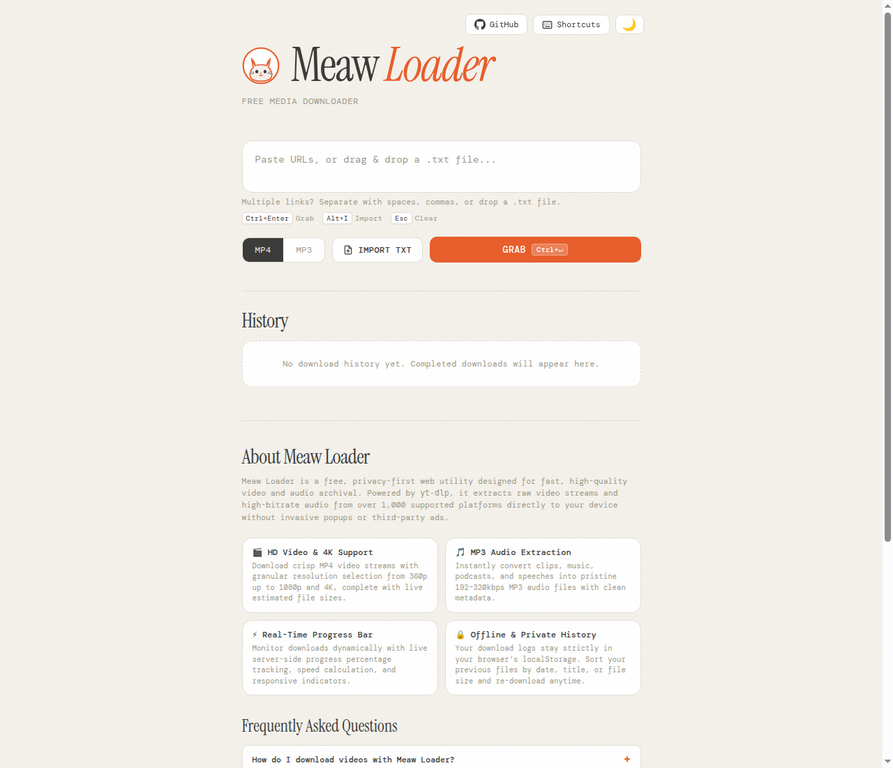

# Meaw Loader

A lightweight, self-hosted media downloader powered by [yt-dlp](https://github.com/yt-dlp/yt-dlp). Download video as MP4 or extract audio as MP3 from supported platforms through a simple browser interface.



## Features

- MP4 video downloads with selectable quality
- MP3 audio extraction
- YouTube playlist URL expansion
- Multiple URL queue and batch downloads
- Live download progress
- Local browser download history
- Responsive light and dark interface
- No database or account required
- LAN access for devices on the same Wi-Fi network

## Requirements

- Python 3.10 or newer
- `ffmpeg`
- A network connection for supported media sites

## Installation

```bash
git clone https://github.com/Quincunx33/Meaw-Loader.git
cd Meaw-Loader
python3 -m pip install -r requirements.txt
```

Install FFmpeg on Debian or Ubuntu:

```bash
sudo apt update
sudo apt install -y ffmpeg
```

## Run

Start the server on port `8080`:

```bash
python3 server.py
```

Open it locally at:

```text
http://localhost:8080
```

To use it from another device on the same Wi-Fi network, find the host computer's local IP:

```bash
hostname -I
```

Then open this address from another device:

```text
http://YOUR_LOCAL_IP:8080
```

For example:

```text
http://192.168.1.10:8080
```

If UFW is enabled, allow the port:

```bash
sudo ufw allow 8080/tcp
```

The server binds to `0.0.0.0`, so it is reachable from other devices on the local network. You can use a different port with the `PORT` environment variable:

```bash
PORT=5000 python3 server.py
```

## API endpoints

| Endpoint | Method | Purpose |
|---|---:|---|
| `/api/info` | POST | Fetch media metadata and available qualities |
| `/api/playlist` | POST | Expand a playlist into individual URLs |
| `/api/download` | POST | Start a video or audio download job |
| `/api/status/<job_id>` | GET | Read download progress |
| `/api/file/<job_id>` | GET | Download the completed file |

## Project structure

```text
.
├── server.py
├── templates/
│   └── index.html
├── static/
├── downloads/
├── requirements.txt
└── README.md
```

## Disclaimer

Use this project only for content you are allowed to download. Respect copyright, platform terms of service, and applicable laws.

## License

This project is distributed under the MIT License. See [LICENSE](LICENSE) for details.
